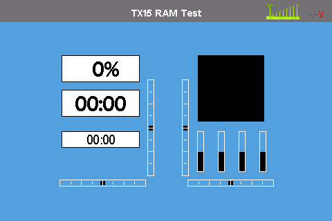

# TX15 native Deviation application: 2026-10-01

Firmware: `54e1730d`, RAM application version 7. No Flash write.

The same application as the first P2 run was loaded again; no speculative
firmware fix was applied. The host added read-only framebuffer capture and
100 ms sampling of the current page, button state and object list, with
symbol addresses tied to the exact ELF hash.

The captured framebuffer shows the original Deviation main page, with
`TX15 RAM Test`, timers and channel bars. This proves application rendering
into the expected framebuffer, not physical panel presentation or input acceptance.

Run: `local/reset-halt-power-20261001-151904.json`.
Capture: `local/ram-runs/20261001-151548/app-screen.ppm`.
Ticks advanced 28537 to 88647; loops 5616 to 17638. No faults or recovery
errors; original firmware resumed. Page remained 0 and sampled buttons
remained zero. No menu interaction is established by this run.

The prior report of three ITEM entries may have been during the approximately
two-minute application/resource transfer, when the bootstrap framebuffer remains
visible and its CPU is halted. Physical display and menu feedback are still
required before P2 acceptance. ADC, RF and persistent model storage remain disabled.

## Coordinated interaction run

`local/reset-halt-power-20261001-152435.json`: page transitions include main,
main menu, model menu and Mixer (page 7), with ENTER/EXIT events recorded.
Ticks 28583 to 88665, loops 5282 to 16077; no faults and recovery succeeded.
Physical display feedback and parameter-edit acceptance remain pending.

The trace exposed an encoder conversion defect: one direction produced mask 11
instead of the single DOWN bit. The ternary argument was expanded by the legacy
`CHAN_ButtonMask` macro without protective parentheses. The native adapter now
selects between two constant masks. A regression using the actual ScanButtons
function failed before the fix and passes afterward, covering both directions
and release intervals. All 33 hardware tool/adapter checks and the final ARM
link pass. The corrected image has not yet been tested on the board.

## Corrected encoder run and scope decision

`local/reset-halt-power-20261001-153357.json`: both direction masks now valid,
no skipped Gray states observed; ticks 28537 to 88591, loops 5466 to 17341,
no faults and original firmware restored. User reports two detents per menu item
in both directions, and explicitly deferred this optimization. Proceed to P3;
parameter-edit validation is combined with the real-stick/mixer run.

## P3 source basis (not yet hardware proof)

ADC1 polling uses LH PA6/ch3, LV PC3/ch13, RV PC4/ch4, RH PC5/ch8,
S1 PC1/ch11, S2 PB1/ch5 from the fixed board definition already recorded in
hardware-map.md. Deviation's platform mapping uses physical Mode 1 order;
MIXER_MapChannel performs the transmitter-mode swap separately.

Register offsets and fields were checked against ST official
[H750 CMSIS definitions](https://github.com/STMicroelectronics/cmsis-device-h7/blob/master/Include/stm32h750xx.h)
and [ADC LL definitions](https://github.com/STMicroelectronics/stm32h7xx-hal-driver/blob/master/Inc/stm32h7xx_ll_adc.h).
The first implementation is limited to this observed Cut 2.x CPU and the existing
HCLK64 bootstrap. ADC12 must be reset-idle; no DMA or ADC interrupt is enabled.
Model, RF and Flash remain unchanged by host-side load/recovery operations.

## P3 first board runs: real sticks and native mixer

First run `local/reset-halt-power-20261001-223203.json` confirmed all six
ADC inputs vary, status 4 throughout, and ADC12 clock/reset recovery succeeded.
Output channels stayed zero. Root cause: embedded test model omitted channel
`template=simple`; original `compact_mixers()` removes entries whose destination
uses MIXERTEMPLATE_NONE. The test model is now a tracked INI under
`hardware/tx15/app/model.ini`, with four explicit simple channel templates.
A model contract regression failed before the fix and passes afterward.

Corrected run `local/reset-halt-power-20261001-223731.json`:

| Input, physical order | Raw observed min | Raw observed max |
| --- | ---: | ---: |
| LH | 442 | 3890 |
| LV | 400 | 3844 |
| RV | 527 | 3537 |
| RH | 409 | 3776 |
| S1 | 0 | 4093 |
| S2 | 0 | 4093 |

Channel output ranges (10000 = 100%): Ch1 -8432..8442, Ch2 -7421..7426,
Ch3 -8774..8041, Ch4 -7832..8993. These are observed movements, not calibration
endpoints. ADC status remained 4. Ticks advanced 569 to 90613, loops 18 to
16687; no faults, recovery errors empty, original firmware resumed.

The UI visited Mixer and mixer editor. Near-neutral Ch2 changed from +214 to
-214 after editing with nearly unchanged RV input; later stick movements also
changed output. This supports a parameter effect, but the exact user operation
and visual direction acceptance still require user confirmation. No persistent
model save, RF transmission or Flash write occurred. Calibration, limits and
conditional complex mixing remain subsequent acceptance items.
