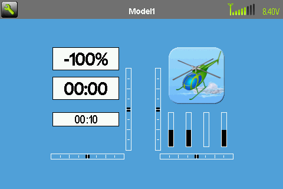
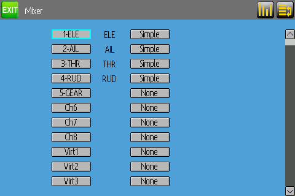
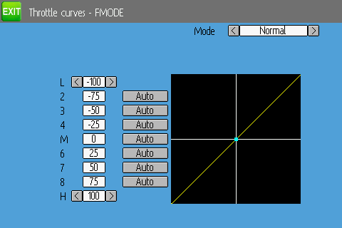

# TX15 彩屏模拟器：第一批

这是原生 Deviation 的电脑端目标 `emu_tx15`，使用自己的 480×320 RGB565 逻辑画布、原有宽屏页面、混控与配置代码。没有硬件 tx15 编译目标，不产生可刷机文件。

## 构建与启动

先按 [构建说明](build.md) 安装工具，然后在项目根目录执行：

```powershell
.\utils\build-msys2.ps1 -Target emu_tx15
.\utils\run-tx15.ps1
```

第二条打开交互窗口。窗口左侧是 480×320 显示区，右侧是输入/输出数值。鼠标模拟触摸；箭头、Enter、Esc 操作焦点、确认与返回。点击显示区外不会被夹到边缘控件。

首次启动脚本将资源复制到 `local/tx15`，以后使用同一目录；重新构建只刷新 `src/filesystem/tx15` 中的开发模板，不覆盖 `local/tx15` 的模型。关闭窗口时可选择保存并退出或不保存退出。启动脚本不要并行运行多份，以免同一模型被多个进程保存。

不要将 `src/filesystem/tx15` 当作日常模型目录，也不要直接运行 exe 后在该模板目录保存重要数据。

## 临时输入配置

这一批复用 Deviation DEVO8 的**电脑测试输入配置**，用于保持已有模型和混控基线；窗口标题明确标注 test inputs。它不是 TX15 物理开关定义。

|键|测试输入|
|---|---|
|q / a|增加 / 减少 Elevator|
|w / s|增加 / 减少 Rudder|
|e / d|增加 / 减少 Throttle|
|r / f|增加 / 减少 Aileron|
|z、x、c、v、b、n|循环 Gear、RUD DR、ELE DR、AIL DR、Mix、FMode|
|对应大写字母|原 Deviation 微调按钮|

摇杆模式会影响物理操纵杆语义，以右侧监视值为准。实际 TX15 开关数量、方向及旧模型迁移仍属后续工作。模拟器没有射频输出，串口/ELRS 接口仍是主机桩。

## 可重复画面检查

使用 Windows 原生 Python：

```powershell
python utils/capture-emulator.py --output local/logs/tx15-main.ppm
python utils/capture-emulator.py --page mixer --output local/logs/tx15-mixer.ppm
python utils/capture-emulator.py --page curve --output local/logs/tx15-curve.ppm
```

脚本为每次检查建立临时文件系统，显式开启捕获模式，等待启动后直接读取实际 framebuffer，检查尺寸、数据长度及非空内容。超时为 15 秒，退出时删除临时目录，不操作 `local/tx15` 的模型。PPM 是未压缩 RGB 图像。页面检查通过代码切换，不等价于鼠标完成编辑、保存、重载的交互验收。

原 320×240 背景图片没有被拉伸冒充新界面：目标启用 Deviation 自带的颜色背景绘制；部分控件仍沿用旧页面尺寸，后续再优化触摸区域和布局。

本次实际运行画面（曲线检查加载自带 `heli_std.ini` 模板）：





已执行：79 项原 CuTest、10 项工具回归、独立 lint；TX15 三种页面捕获及原 DEVO8 模拟器构建/320×240 主界面捕获、Arm DEVO8 固件构建通过。曲线捕获还检查绘图区，避免将“Invalid model ini!”错误画面算作通过。完整鼠标编辑与保存交互尚未验收。

## 本批修复范围

- 新增独立主机目标及画布，沿用 Deviation 的宽屏页面分支。
- 增加触摸边界、偏移和缩放映射检查。
- 语言容量检查器支持只有模拟器的目标。
- 修复显示/模型配置用 `long` 承载指针导致的 Windows 64 位地址截断；使用指针宽度整数计算字段偏移，以字节指针访问字段。模型字段、文件格式及混控运算不变。

后续：实际 TX15 输入映射、模型兼容规则、复杂混控与曲线的完整交互回归，以及硬件驱动。当前开发不依赖其他固件的信息。
